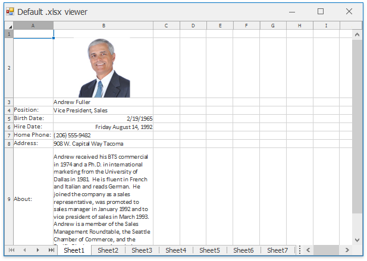

<!-- default badges list -->

<!-- default badges end -->

# Spreadsheet Document API - Execute a Mail Merge in Code

This example demonstrates how to use the [Spreadsheet Mail Merge](https://docs.devexpress.com/OfficeFileAPI/118749/spreadsheet-document-api/mail-merge) functionality to automatically generate a document based on data retrieved from an object data source. 

The [mail merge template](https://docs.devexpress.com/OfficeFileAPI/118747/spreadsheet-document-api/mail-merge/template-document) is created in code when the application starts. The data source is specified using the [Workbook.MailMergeDataSource](https://docs.devexpress.com/OfficeFileAPI/DevExpress.Spreadsheet.Workbook.MailMergeDataSource) property. The [Workbook.GenerateMailMergeDocuments](https://docs.devexpress.com/OfficeFileAPI/DevExpress.Spreadsheet.Workbook.GenerateMailMergeDocuments) method accomplishes mail merge and returns the resulting workbook. Since the mail merge mode is set to **Multiple Sheets**, all worksheets created by the **GenerateMailMergeDocuments** method are contained in a single workbook.

## Files to Review

* [Program.cs](./CS/MailMergeExample/Program.cs) (VB: [Program.vb](./VB/MailMergeExample/Program.vb))

## Documentation

* [Mail Merge in the Spreadsheet Document API](https://docs.devexpress.com/OfficeFileAPI/118749/spreadsheet-document-api/mail-merge)

<!-- feedback -->
## Does this example address your development requirements/objectives?

 

(you will be redirected to DevExpress.com to submit your response)
<!-- feedback end -->
